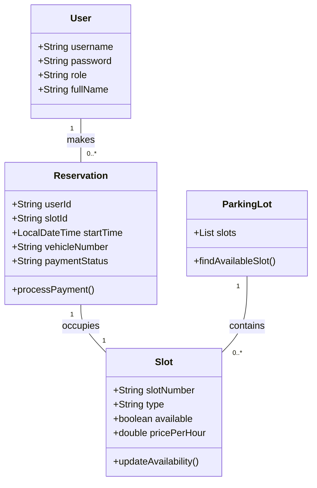

# Parking Management System - Academic Documentation

This document outlines the Object-Oriented Analysis and Design (OOAD), Software Project Management (SPM), and Software Testing (ST) focus areas for the Smart Parking Reservation System.

## 1. Object-Oriented Analysis and Design (OOAD)

### Logic and Design
The system is built using a **Microservices-ready architecture** with Spring Boot. It follows the **Model-View-Controller (MVC)** pattern for clear separation of concerns.

### Use Case Diagram (Summary)
- **Actor: User**
  - Use Case: Search for available slots.
  - Use Case: Reserve a slot (Conflict-free).
  - Use Case: View personal booking history.
  - Use Case: Process payment simulation.
- **Actor: Admin**
  - Use Case: Add/Update parking slots.
  - Use Case: View all active reservations.
  - Use Case: Manage pricing and availability.

### Class Diagram

---

## 2. Software Project Management (SPM)

### Risk Management
- **Risk: Incorrect Occupancy Data**
  - *Mitigation*: Implementation of strict transactional logic in the backend. When a slot is reserved, its status is immediately updated in MongoDB before confirming the reservation.
- **Risk: Peak-Hour Performance**
  - *Mitigation*: Use of indexing in MongoDB for `slotNumber` and `available` fields to ensure fast lookups during high traffic.

### Scheduling & Integration
- **Sensor Integration Strategy**: The system is designed with an API-first approach, allowing physical IoT sensors to update slot status via `POST /api/admin/slots` endpoints.

---

## 3. Software Testing (ST)

### Conflict-Free Reservations
- **Test Case**: Two users attempt to book the same slot at the exact same millisecond.
- **Strategy**: Use of MongoDB's atomic operations and `@Version` or custom check-and-set logic in `ParkingService.java` to prevent overbooking.

### Overbooking Prevention
- **Unit Test**: `testReserveSlot_AlreadyOccupied()` ensures that the service throws an exception and refuses the second booking if `available == false`.

### Availability Updates
- **Integration Test**: Verify that once a user completes a payment or a reservation expires, the slot status reverts to `AVAILABLE` correctly in the database.
